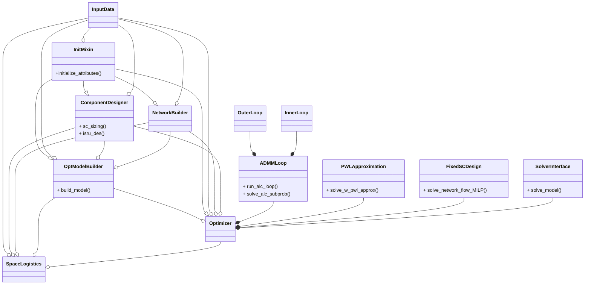
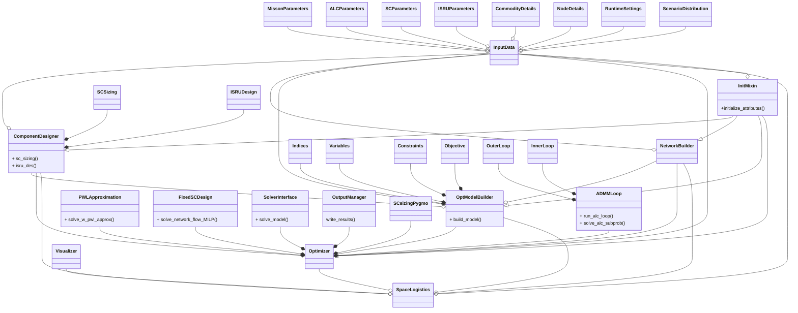
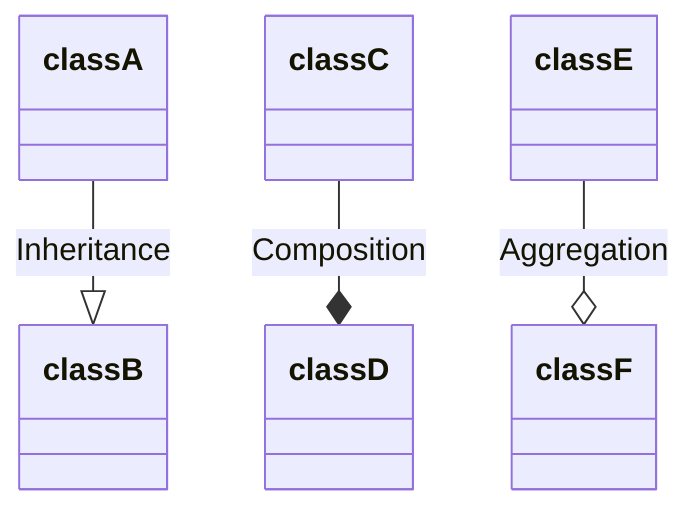

# Class Diagram

Diagrams to show how classes in this code base interact

### Simplified Class Diagram

Main class methods you might use as a user are also included

### Full Class Diagram

Class diagram notations are as follows:

where

- classB inherits classA
- classD composes (i.e., owns) classC
- classF aggregates (i.e., contains) classE

See [inheritance vs composition vs aggregation](https://dev.to/adhirajk/inheritance-vs-composition-vs-aggregation-432i) for your reference. In short, an aggregated class can exist without its aggregating class but a composed class cannot without its composing class (stronger dependency).
