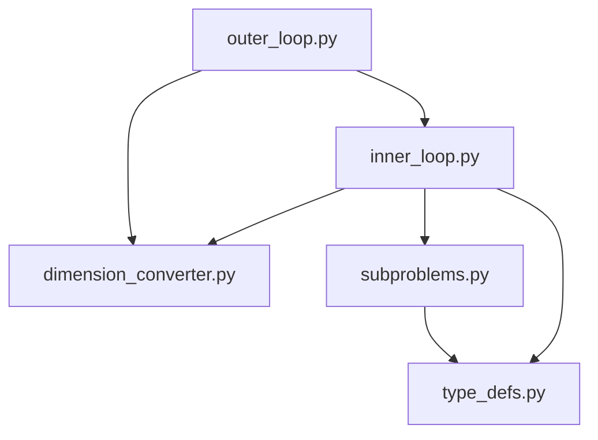

Python implementation of Augmented Lagrangian Coordination framework for decomposition-based and multidisciplinary design optimization

# Installation

## Prerequisites

To build the environment and use the code in this repository, you will need to have the following installed:

- `poetry` for dependency management (see `docs/poetry_installation.md`)
- optimization solvers of your choice (Gurobi, BARON, CPLEX, IPOPT, SCIP, etc. See `docs/ipopt_installation.md` for IPOPT instructions.)
- anaconda/miniconda (optional but recommended for managing Python environments)

## Dependency Installation

With `conda`, run:

```sh
conda create -n alc python=3.11.2
conda activate alc
poetry install
```

If `virtualenv` or similar is preferred, run poetry install in the newly created virtual environment with python version 3.11.2 or later.
Optimization problems are modelled using `pyomo` in the current version.

## Testing

Run tests to ensure that the package works correctly after installation:

```sh
pytest
```

### Legacy version for Linux

On Linux, the legacy version lets you use `pygmo` and its compatible solvers for continuous nonlinear programming (NLP) problems.
To install the dependency for this legacy version, run the poetry command with `-E legacy` flag:

```sh
poetry install -E legacy
```

A separate set of tests for the legacy version can be run with:

```sh
pytest -m legacy
```

This version is unsupported on other platforms.

# Module Dependencies Map

Note: $\fbox{calling module} \rightarrow \fbox{called module}$



# References

- [Augmented Lagrangian coordination for distributed optimal design in MDO](http://dx.doi.org/10.1002/nme.2158)
- [MDO Approach to Integrated Space Mission Planning and Spacecraft Design](http://dx.doi.org/10.2514/1.A35284)

# Acknowledgment

This material is based upon work supported by the National Science Foundation under Award No. 1942559.
Any opinions, findings and conclusions or recommendations expressed in this material are those of the author(s) and do not necessarily reflect the views of the National Science Foundation.
